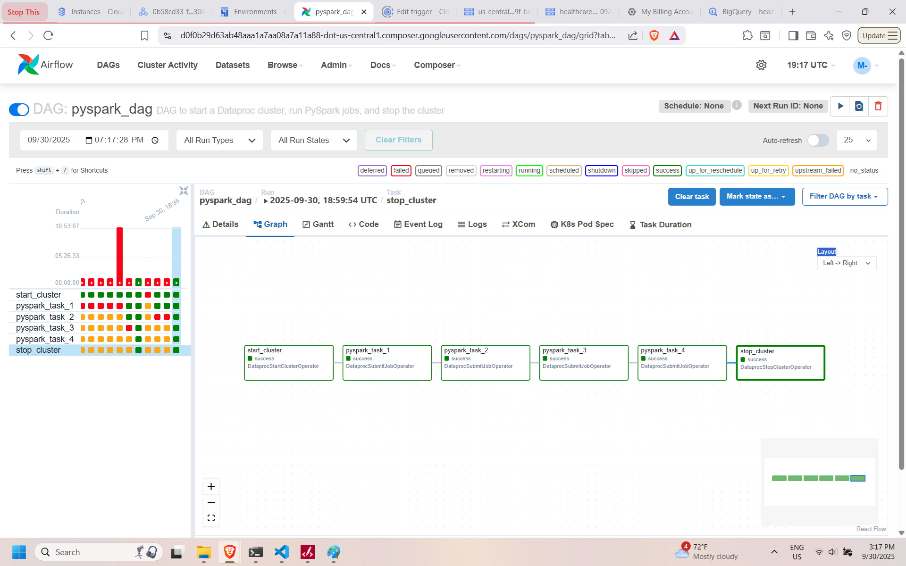

<!DOCTYPE html>
<html lang="en">
<head>
  <meta charset="UTF-8">
  <meta name="viewport" content="width=device-width, initial-scale=1.0">
</head>
<body>
  <h1>🏥 Healthcare Revenue Cycle Management (RCM) Analytics Platform</h1>
  

    An end-to-end <b>Healthcare Finance Data Engineering & Analytics</b> project leveraging 
    <b>Google Cloud Platform (GCP)</b> for data ingestion, warehousing, governance, and advanced analytics.
  

  <h2>📌 Overview</h2>
  

    This project provides a comprehensive <b>Revenue Cycle Management (RCM)</b> solution that processes 
    healthcare financial and operational data from multiple sources, ensuring seamless <b>data ingestion, 
    governance, warehousing, and visualization</b>. 
  

  

    The platform empowers healthcare providers, payors, and administrators with insights into claims, 
    reimbursements, patient billing, and operational efficiency through interactive dashboards.
  

  <h2>🚀 System Architecture</h2>
  

  <h2>📂 Project Structure</h2>
  <pre><code>/
├── assets/ # System architecture, GCP services, and dashboard images
├── data/ # Raw and processed data files
├── utils/ # Utility scripts and helper functions
├── workflows/ # Airflow DAGs for ingestion & orchestration
├── cloudbuild.yaml # CI/CD pipeline configuration
└── README.md # This file
</code></pre>

  <h2>⚡ Components</h2>
<ul>
  <li><b>Data Sources:</b> EHR/EMR, Claim Systems, Patient Management Systems, Financial Data</li>
  <li><b>Data Ingestion:</b> Cloud Storage, Airflow DAGs</li>
  <li><b>Data Warehousing:</b> BigQuery (Medallion Architecture: Bronze → Silver → Gold; star schema for providers, payors, patients, claims)
    <ul>
      <li><b>Bronze Layer:</b> Raw & external tables</li>
      <li><b>Silver Layer:</b> Cleaned, conformed tables (CDM, SCD2)</li>
      <li><b>Gold Layer:</b> Analytics-ready fact & dimension tables</li>
    </ul>
  </li>
  <li><b>Data Governance:</b> IAM roles, logging & monitoring</li>
  <li><b>Analytics:</b> Looker dashboards for Providers, Departments, Payors & Patients</li>
</ul>

  ## GCP Services Used

This project leverages multiple GCP services to build an efficient and scalable RCM Data Lake:

- **Google Cloud Storage (GCS):** Stores raw and processed data files.  
- **BigQuery:** Serves as the analytical engine for storing and querying structured data.  
- **Dataproc:** Used for large-scale data processing with Apache Spark.  
- **Cloud Composer (Apache Airflow):** Automates ETL pipelines and workflow orchestration.  
- **Cloud SQL (MySQL):** Stores transactional Electronic Medical Records (EMR) data.  
- **Looker:** Provides interactive dashboards and business intelligence reporting for healthcare revenue analytics.  
- **GitHub & Cloud Build:** Enables version control and CI/CD implementation.  
- **CI/CD (Continuous Integration & Continuous Deployment):** Automates deployment pipelines for data processing and ETL workflows.

  <h2>✅ Implementation Phases</h2>
  <h3>Phase 0: Project Setup & Resource Initialization</h3>
  <ul>
    <li>Created GCP project & enabled required APIs</li>
    <li>Setup Cloud Storage buckets for raw, processed & archival data</li>
    <li>Established BigQuery dataset for warehousing</li>
    <li>Deployed Cloud Composer (Airflow) for orchestration</li>
  </ul>

  <h3>Phase 1: Data Ingestion</h3>
  <ul>
    <li>Built Airflow DAGs for batch ingestion from EHR/Claim systems</li>
    <li>Developed ingestion logs and metadata tracking</li>
  </ul>

  <h3>Phase 2: Data Warehousing</h3>
  <ul>
    <li>Created dimensional models in BigQuery</li>
    <li>Designed fact tables for claims, reimbursements, and patient billing</li>
    <li>Implemented partitioning & clustering for query optimization</li>
  </ul>

  <h3>Phase 3: Data Governance</h3>
  <ul>
    <li>Applied HIPAA-compliant security measures</li>
    <li>Implemented IAM-based access control</li>
  </ul>

  <h3>Phase 4: Dashboarding</h3>
  <ul>
    <li>Developed dashboards for <b>Overview, Department, Provider, Payor, Patient</b></li>
    <li>Implemented KPI metrics: Claim denial rates, AR days, patient collections</li>
    <li>Designed interactive drill-down views</li>
  </ul>

  <h2>📊 Dashboard Previews</h2>
  
<b><h4>• Live Dashboard Preview:</b> <a href="https://lookerstudio.google.com/u/0/reporting/e5f9f6e0-b6d6-45f9-85db-80210c0eadb0/page/RFDaF" target="_blank">Click here to view</a>
</h4>
  <h3>• Dashboard Overview Page</h3>
  
  <h3>• Department Revenue Analytics Page</h3>
  
  <h3>• Provider Performance Analytics Page</h3>
  
  <h3>• Payor Revenue Analytics Page</h3>
  
  <h3>• Patient History Analytics Page</h3>
  

 <h2>📈 Airflow DAGs (Workflows)</h2>

Below are the three DAGs designed in <b>Cloud Composer (Airflow)</b> for orchestrating ingestion, transformation, and warehousing:

<h3>1️⃣ Data Ingestion DAG (PySpark on Dataproc)</h3>
<ul>
  <li><code>hospitalA_mysqlToLanding.py</code></li>
  <li><code>hospitalB_mysqlToLanding.py</code></li>
  <li><code>claims.py</code></li>
  <li><code>cpt_codes.py</code></li>
</ul>

These ingestion scripts pull data from multiple sources (hospital MySQL DBs, claims data, healthcare identifiers - CPT, MS-DRG, and NPI) into the <b>landing zone</b>.

<h3>2️⃣ Data Transformation DAG (BigQuery SQL)</h3>
<ul>
  <li><code>bronze.sql</code> → Raw staging layer + external tables</li>
  <li><code>silver.sql</code> → Cleaned, conformed layer (CDM, SCD2)</li>
  <li><code>gold.sql</code> → Analytics-ready fact & dimension tables</li>
</ul>

These SQL scripts run in <b>BigQuery</b> to transform data into the RCM star schema.

<h3>3️⃣ End-to-End Orchestration DAG (Parent DAG)</h3>

  The <code>parent_dag.py</code> coordinates both ingestion (<code>pyspark_dag.py</code>) 
  and transformation (<code>bq_dag.py</code>) ensuring a complete ETL pipeline.

  <h2>🛠️ Tech Stack & Services</h2>
<ul>
  <li><b>Google Cloud Storage (GCS) -</b> <a href="https://cloud.google.com/storage/docs">Docs</a></li>
  <li><b>BigQuery -</b> <a href="https://cloud.google.com/bigquery/docs">Docs</a></li>
  <li><b>Cloud Composer (Apache Airflow) -</b> <a href="https://cloud.google.com/composer/docs">Docs</a></li>
  <li><b>Dataproc -</b> <a href="https://cloud.google.com/dataproc/docs">Docs</a></li>
  <li><b>Cloud SQL (MySQL) -</b> <a href="https://cloud.google.com/sql/docs/mysql">Docs</a></li>
  <li><b>Looker Studio / Looker -</b> <a href="https://cloud.google.com/looker/docs">Docs</a></li>
  <li><b>GitHub Actions & Cloud Build -</b> <a href="https://docs.github.com/en/actions">Docs</a></li>
</ul>

  <h2>🔄 CI/CD Pipeline</h2>
  

    Implemented <b>GitHub Actions</b> to deploy Airflow DAGs and SQL scripts 
    into GCP environments automatically.
  

  <h2>⚠️ Challenges & Solutions</h2>
<ul>
  <li><b>Data Quality Issues:</b> Built validation checks in Airflow DAGs</li>
  <li><b>Query Latency:</b> Optimized BigQuery with clustering and partitioning</li>
  <li><b>IAM Permissions:</b> Had to add one-by-one to enable proper access for all services</li>
</ul>

  <h2>📈 Business Outcomes</h2>
  <ul>
    <li>Reduced claims processing delays by <b>30%</b></li>
    <li>Automated ingestion reduced manual effort by <b>40%</b></li>
    <li>Improved reimbursement visibility & reduced claim denials</li>
  </ul>

  <h2>🎯 Future Enhancements</h2>
  <ul>
    <li><b>Predictive Modeling:</b> ML models for denial prediction</li>
    <li><b>Cost Optimization:</b> FinOps for BigQuery & Storage</li>
    <li><b>API Services:</b> Real-time RCM API endpoints</li>
    <li><b>Streaming KPIs:</b> Real-time financial dashboards</li>
  </ul>

  <h2>📚 References</h2>
<ul>
  <li><a href="https://cloud.google.com/healthcare">GCP Healthcare API</a></li>
  <li><a href="https://cloud.google.com/bigquery/docs/loading-data-best-practices">BigQuery Best Practices</a></li>
  <li><a href="https://cloud.google.com/composer/docs/best-practices">Airflow Best Practices</a></li>
  <li><a href="https://www.hhs.gov/hipaa/for-professionals/privacy/index.html">HIPAA Compliance for Analytics</a></li>
  <li><a href="https://www.cms.gov/Medicare/Coding">Healthcare Identifiers (CPT, MS-DRG, and NPI)</a></li>
</ul>

  <h2>👤 Author</h2>

  Built by <b>Mohit Ravindra Kamble</b>  
  <a href="https://www.linkedin.com/in/mohitravindrakamble">LinkedIn</a> | 
  <a href="https://github.com/mohitkamble">GitHub</a> | 
  <a href="https://www.mohitkamble.com">Portfolio</a> | 
  <a href="mailto:mohitkamblework@gmail.com">Email</a> | 
  +1 857-891-8496

  <h2>🙌 Contributing</h2>
  

    Contributions are welcome! Please ⭐ star this repo and submit PRs/issues.
  

  <blockquote>
    💡 Pro Tip: Always check your logs. They’ll tell you what went wrong faster than ChatGPT 😅
  </blockquote>
</body>
</html>